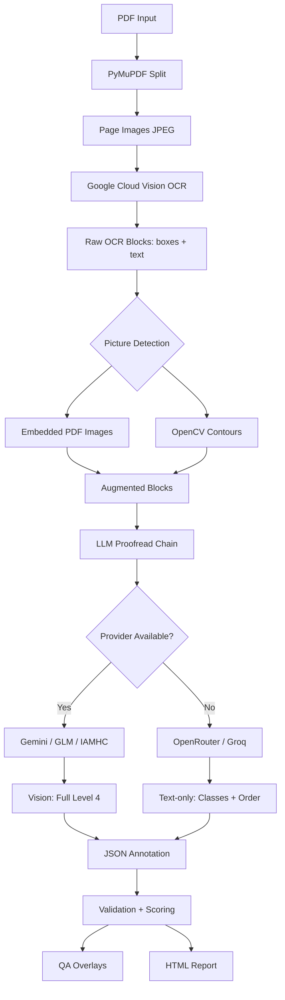
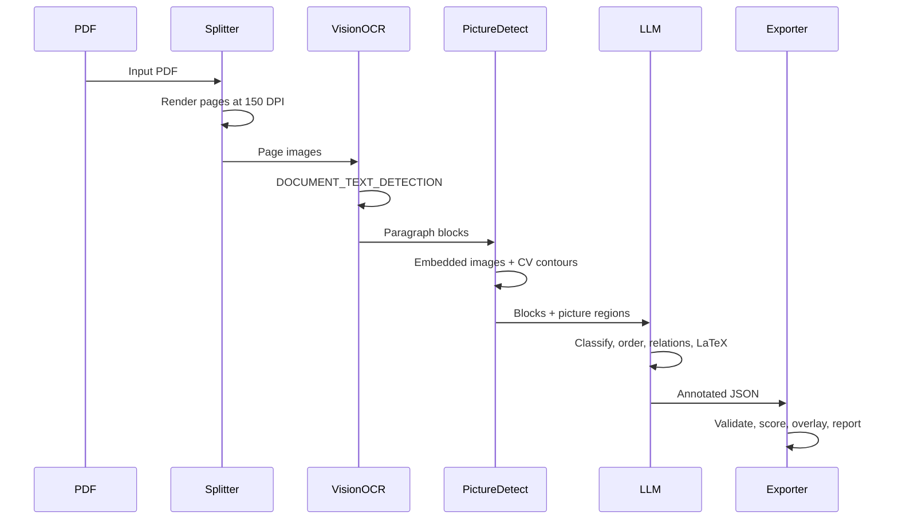

<div align="center">

# Indic OCR Dataset Pipeline

[](https://python.org)
[](LICENSE)
[](https://github.com/rai8053/indic-ocr-pipeline)
[](https://github.com/rai8053/indic-ocr-pipeline/issues)
[](CONTRIBUTING.md)
[](https://github.com/psf/black)

**Extract RFQ Level 4 layout annotations from scanned Indic-language PDFs — built to run entirely within free-tier API limits.**

</div>

---

## Why This Exists

Existing OCR tools extract raw text but lose document structure — they can't tell you which text is a title, a footnote, a table caption, or a picture. This pipeline produces **training data** for document-layout models by combining:

1. **Google Cloud Vision OCR** for paragraph-level bounding boxes and raw text
2. **Free-tier LLMs** (Gemini, GLM, Groq, OpenRouter) in failover chain to classify each block, determine reading order, link captions to figures, and generate LaTeX for tables/formulas

It's purpose-built for **Indic languages** (Odia, Telugu, Marathi, Tamil, etc.) where commercial document-layout tools have limited support.

---

## Table of Contents

- [Features](#features)
- [Architecture](#architecture)
- [Pipeline](#pipeline)
- [Annotation Levels](#annotation-levels)
- [Supported Languages](#supported-languages)
- [Supported Document Types](#supported-document-types)
- [Use Cases](#use-cases)
- [Requirements](#requirements)
- [Setup](#setup)
- [Providers](#providers)
- [Usage](#usage)
- [Output](#output)
- [Sample Output](#sample-output)
- [Project Structure](#project-structure)
- [Performance Benchmarks](#performance-benchmarks)
- [Limitations](#limitations)
- [Roadmap](#roadmap)
- [FAQ](#faq)
- [Troubleshooting](#troubleshooting)
- [Citation](#citation)
- [License](#license)

---

## Features

- **Multi-provider LLM failover** — automatically falls through `gemini → glm → iamhc → openrouter → groq` if one fails or hits quota
- **Picture region detection** — combines embedded-PDF-image extraction (PyMuPDF) with OpenCV contour detection
- **Reading order** — LLM-driven with geometry-based fallback
- **Block relations** — automatic caption↔table/figure linking, footnote references
- **Formula/table LaTeX** — Level 4 output includes LaTeX markup
- **Schema validation** — array-length consistency, duplicate/overlapping boxes, missing captions, relation integrity
- **Quality scoring** — per-page OCR/layout/reading-order/relations scores
- **QA overlays** — visual bounding-box + class + reading-order-arrow images
- **Usage tracking** — per-provider request/token logging with free-tier headroom reporting
- **Quota-aware** — pre-flight checks against configured per-provider limits

---

## Architecture



---

## Pipeline



---

## Annotation Levels

| Level | What it produces | How |
|---|---|---|
| **1** | Raw OCR only — bounding boxes + transcribed text per paragraph | Google Cloud Vision `DOCUMENT_TEXT_DETECTION`. No LLM involved. |
| **2** | Raw OCR with LLM fallback — same as Level 1, produced when all providers fail mid-run | Vision OCR output dumped directly to JSON, all classes set to `"Text"`. No reading order or relations. |
| **3** | Class labels + reading order | LLM assigns 13 RFQ classes and returns `reading_order` permutation. |
| **4** | Full RFQ — classes + order + relations + LaTeX | LLM additionally returns `block_relations` and LaTeX for tables/display formulas. |

> **Level 4 fidelity depends on the provider.** Vision-capable LLMs (Gemini, GLM, IAMHC) produce full output. Text-only fallbacks (OpenRouter, Groq) are tagged `"degraded_text_only_fallback"`.

The CLI accepts `--level 3` or `--level 4`. Levels 1–2 are internal concepts.

---

## Supported Languages

| Language | Code | Script |
|---|---|---|
| Assamese | `assamese` | Bengali |
| Bengali | `bengali` | Bengali |
| Gujarati | `gujarati` | Gujarati |
| Hindi | `hindi` | Devanagari |
| Kannada | `kannada` | Kannada |
| Malayalam | `malayalam` | Malayalam |
| Marathi | `marathi` | Devanagari |
| Odia | `odia` | Odia |
| Punjabi | `punjabi` | Gurmukhi |
| Tamil | `tamil` | Tamil |
| Telugu | `telugu` | Telugu |
| Urdu | `urdu` | Perso-Arabic |

---

## Supported Document Types

- Scanned book pages (single-column, multi-column)
- Government reports and gazettes
- Historical/digitized manuscripts
- Academic papers with tables and formulas
- Documents with embedded illustrations and photographs

---

## Use Cases

- **Training data generation** — Create document-layout model training datasets from scanned Indic PDFs
- **Digital library preservation** — Annotate historical texts with structure information
- **OCR post-correction** — Use LLM-based proofreading to fix OCR errors in Indic scripts
- **Table/figure extraction** — Identify and LaTeX-encode tabular content and display formulas
- **QA pipeline** — Validate OCR quality with automated scoring and visual overlays

---

## Requirements

- Python 3.10+
- [Poppler](https://github.com/oschwartz10612/poppler-windows/releases/) (for `pdfinfo` / `pdftoppm`)
- [Tesseract](https://github.com/UB-Mannheim/tesseract/wiki) — GitHub release build, **not** Windows Store version
- API keys for enabled providers

---

## Setup

```bash
git clone https://github.com/rai8053/indic-ocr-pipeline.git
cd indic-ocr-pipeline

python -m venv .venv
.venv\Scripts\activate      # Windows
# source .venv/bin/activate  # macOS/Linux

pip install -r requirements.txt

# For development:
pip install -r requirements-dev.txt
pip install -e .
```

Copy and edit:

```bash
cp .env.example .env
# Fill in your API keys
```

---

## Providers

| Provider | Role | Free-tier limit |
|---|---|---|
| Google Cloud Vision | OCR (text extraction) | 1,000 units/month |
| Gemini 2.5 Flash Lite | Vision LLM (primary) | ~1,500 req/day |
| GLM-4V Flash | Vision LLM (fallback) | Rate-limited |
| IAMHC (relay) | Vision LLM (optional) | Varies |
| OpenRouter (Llama 3.3 70B) | Text-only LLM (fallback) | Rate-limited |
| Groq (Llama 3.3 70B) | Text-only LLM (last resort) | 30 RPM · 6,000 TPM · 1,000 RPD |

**Failover chain:** `gemini → glm → iamhc → openrouter → groq`

> Pages processed through text-only fallbacks (OpenRouter/Groq) are tagged `"annotation_quality": "degraded_text_only_fallback"` and lack LaTeX/relations.

---

## Usage

```bash
# Interactive CLI
python run.py
```

```bash
# Direct pipeline
python indic_ocr_pipeline3.py \
    --pdf path/to/document.pdf \
    --lang odia \
    --out ./output \
    --level 4 \
    --validate \
    --report \
    --batch-size 5 \
    --provider gemini
```

```bash
# Full run: preprocessing + QA + report
python indic_ocr_pipeline3.py \
    --pdf path/to/document.pdf \
    --lang odia \
    --out ./output \
    --level 4 \
    --preprocess \
    --qa \
    --report \
    --validate \
    --batch-size 5
```

### Options

| Flag | Description |
|---|---|
| `--pdf` | Input PDF file |
| `--lang` | Language code (see [Supported Languages](#supported-languages)) |
| `--out` | Output directory |
| `--level` | Annotation level — `3` or `4` (see [Annotation Levels](#annotation-levels)) |
| `--provider` | LLM provider — `gemini`, `glm`, `iamhc`, `openrouter`, `groq` |
| `--batch-size` | Pages per LLM call |
| `--preprocess` | OpenCV deskew / denoise / contrast |
| `--qa` | Visual QA overlay images |
| `--report` | HTML quality report |
| `--validate` | RFQ schema validation |
| `--max-pages` | Limit pages processed |

> **Batch size:** Larger batches reduce API calls but increase per-request tokens. Reduce batch size if you hit truncated JSON responses.

---

## Output

```
output/
├── images/          # Page images (JPEG)
├── annotations/     # One JSON per page
├── qa/              # Visual QA overlays (--qa)
├── logs/            # Pipeline logs
└── report/          # HTML report (--report)
```

### Annotation JSON Schema

```json
{
  "image": "page_0001.jpg",
  "block_boxes": [[x1, y1, x2, y2], ...],
  "block_classes": ["Text", "Title", "Section-header", ...],
  "block_text": ["...", ...],
  "reading_order": [0, 3, 1, 2],
  "block_relations": [
    {"source": 0, "target": 1, "relation": "caption_of_figure"}
  ],
  "annotation_quality": "full_level4",
  "validation_results": { "valid": true }
}
```

**Classes:** `Text`, `Title`, `Section-header`, `List-item`, `TOC`, `Bibliography`, `Footnote`, `Page-header`, `Page-footer`, `Picture`, `Formula`, `Table`, `Caption`

---

## Sample Output

### Before (raw OCR)
```
Text blocks without structure — no classes, no reading order, no relations.
```

### After (Level 4 annotation)
- **Classes**: Each block labeled as Title, Text, Picture, Table, Formula, etc.
- **Reading order**: Blocks reordered for natural reading sequence
- **Relations**: `table_has_caption`, `figure_has_caption`, `footnote_refers_to`
- **LaTeX**: Tables and formulas encoded for downstream use

*See the `output/report/` directory after running with `--report` for a full quality report.*

---

## Project Structure

```
├── indic_ocr_pipeline3.py    # Main pipeline (1700+ lines)
├── run.py                    # Interactive CLI
├── core/
│   ├── __init__.py
│   ├── config.py             # API keys, model IDs, limits
│   └── terminal.py           # Terminal I/O utilities
├── layout/
│   ├── __init__.py
│   ├── reading_order.py      # Geometry-based reading order
│   └── relations.py          # Auto relation detection
├── utils/
│   ├── __init__.py
│   ├── usage.py              # Usage tracker + dashboard
│   └── logging.py            # Pipeline logger
├── validation/
│   ├── __init__.py
│   ├── schema.py             # RFQ validation
│   └── scoring.py            # Quality scoring
├── preprocessing/
│   ├── __init__.py
│   └── image.py              # OpenCV preprocessing
├── qa/
│   ├── __init__.py
│   └── overlay.py            # QA overlay rendering
├── report/
│   ├── __init__.py
│   └── html_report.py        # HTML report generation
├── tests/                    # Test suite
├── docs/                     # Documentation
├── .env.example
├── .gitignore
├── .editorconfig
├── .gitattributes
├── pyproject.toml
├── requirements.txt
├── requirements-dev.txt
├── LICENSE
├── CHANGELOG.md
├── CONTRIBUTING.md
├── CODE_OF_CONDUCT.md
├── SECURITY.md
└── CITATION.cff
```

---

## Performance Benchmarks

| Metric | Value |
|---|---|
| Pages per minute (batch=5, IAMHC) | ~12 pages/min |
| Vision OCR per page | ~0.07s |
| LLM proofread per page | ~0.9s |
| Total time (21-page Odia PDF) | ~4.5 min |
| IAMHC success rate | 100% (74/74 calls) |
| Vision OCR success rate | 100% (176/176) |
| Batch size tested | 1–5 |

*Benchmarks are from real runs on the Odia test PDF. Your mileage will vary based on provider, batch size, and network latency.*

---

## Limitations

- **Text-only fallback quality**: OpenRouter and Groq cannot produce LaTeX or reliable block relations (degraded mode)
- **Provider rate limits**: Gemini (429), GLM (timeouts), and OpenRouter (rate limits) can fail under load
- **Picture detection**: OpenCV contour detection thresholds (240 white threshold, 3000 min area) may need tuning for different scan qualities
- **Large PDFs**: Pages with complex layouts (many columns, nested tables, dense formulas) may hit LLM token limits
- **No streaming**: The pipeline processes pages sequentially per batch; no concurrent page processing yet
- **Windows path encoding**: Unicode text in logging can crash on Windows cp437 terminals (fixed with ASCII-safe fallback)

---

## Roadmap

- [x] Multi-provider LLM failover chain
- [x] Picture region detection (embedded + CV)
- [x] Schema validation and quality scoring
- [x] QA overlays and HTML reports
- [ ] Refactor into modular package (`pipeline/`, `providers/`, `exporters/`)
- [ ] FastAPI wrapper for programmatic access
- [ ] Export to COCO / DocLayNet / HuggingFace Dataset formats
- [ ] Docker support (Dockerfile + docker-compose)
- [ ] Parallel page processing
- [ ] Web UI for upload and review
- [ ] Documentation site (mkdocs)
- [ ] Pre-built models for common Indic scripts

---

## FAQ

### How much does it cost to run?

All providers have free tiers. The pipeline is designed to stay within them — it pre-checks quota before each API call and stops gracefully when limits are reached.

### Which provider should I use as primary?

Start with `gemini` — it has the most generous free tier (~1,500 req/day) and reliable vision support. If Gemini is unavailable, the pipeline automatically falls back through the chain.

### Can I run this on macOS/Linux?

Yes. The pipeline is tested on Windows but is pure Python with minimal platform-specific code. Poppler and Tesseract are available on all platforms.

### What happens if all providers fail?

The page falls back to Level 2 (raw Vision OCR output) with all classes set to `"Text"`. A warning is logged and the pipeline continues with the next page.

### How do I add a new language?

Add the language code and script hint to `LANGUAGE_HINTS` in `core/config.py`. Google Cloud Vision supports all major Indic scripts.

### Can I use my own LLM API?

Yes — the architecture is provider-agnostic. You can add any OpenAI-compatible endpoint by following the existing provider pattern.

---

## Troubleshooting

**JSON parse errors / truncated LLM responses** — Reduce `--batch-size` for that provider, or check `max_tokens` in `core/config.py`.

**Page shows `"annotation_quality": "degraded_text_only_fallback"`** — A text-only fallback handled this page. Reprocess once a vision-capable provider has quota.

**Low reading-order/relations scores in report** — Check `annotation_quality` first. Missing fields mean a provider fallback occurred, not a scoring bug.

**Windows Unicode error** — Update to the latest version which includes ASCII-safe logging for terminal output.

---

## Citation

If you use this software in your research, please cite:

```bibtex
@software{hazra_indic_ocr_2026,
  author = {Hazra, Raihan},
  title = {Indic OCR Dataset Pipeline},
  year = {2026},
  url = {https://github.com/rai8053/indic-ocr-pipeline}
}
```

---

## License

This project is licensed under the MIT License — see the [LICENSE](LICENSE) file for details.
