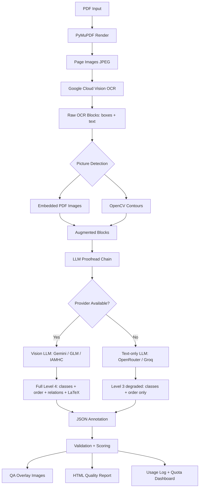
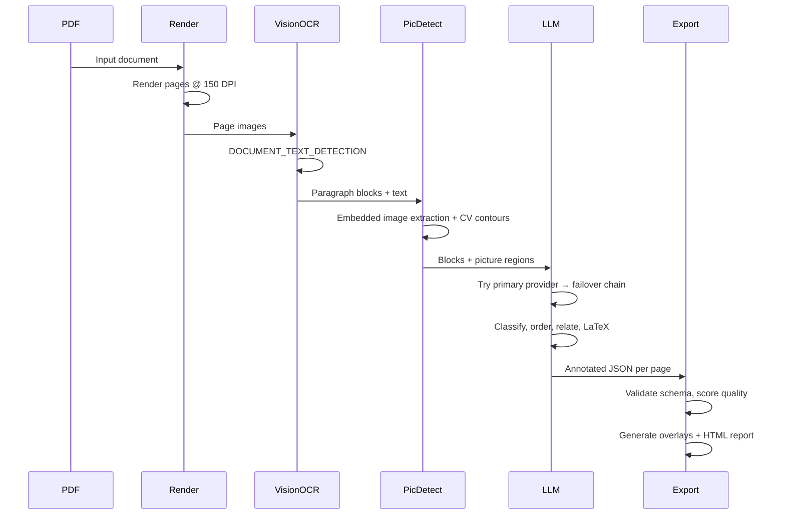
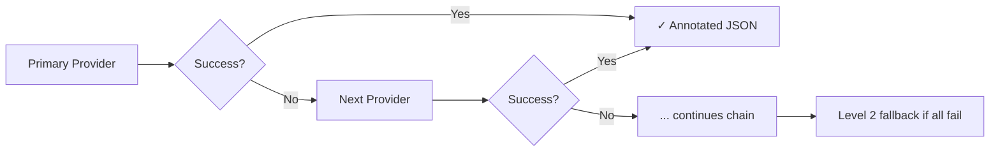

<div align="center">
  <br/>
  <h1>🕵️ Indic OCR Pipeline</h1>
  <p><strong>RFQ Level 4 layout annotation for Indic-language scanned PDFs — free-tier only.</strong></p>
  <br/>
</div>

<div align="center">

[](https://python.org)
[](LICENSE)
[](https://github.com/rai8053/indic-ocr-pipeline/actions)
[](https://github.com/psf/black)
[](https://github.com/astral-sh/ruff)
[](http://mypy-lang.org)
[](CONTRIBUTING.md)
[](https://github.com/rai8053/indic-ocr-pipeline)

</div>

---

## 📋 Table of Contents

- [Overview](#overview)
- [Features](#features)
- [Architecture](#architecture)
- [Pipeline Flow](#pipeline-flow)
- [Annotation Levels](#annotation-levels)
- [Project Structure](#project-structure)
- [Requirements](#requirements)
- [Installation](#installation)
- [Configuration](#configuration)
- [Quick Start](#quick-start)
- [Usage](#usage)
- [Providers](#providers)
  - [OCR Provider](#ocr-provider)
  - [LLM Providers & Failover](#llm-providers--failover)
- [Output Format](#output-format)
  - [JSON Schema](#json-schema)
  - [Class Taxonomy](#class-taxonomy)
  - [Relation Types](#relation-types)
- [Benchmarks](#benchmarks)
- [Performance](#performance)
- [Limitations](#limitations)
- [FAQ](#faq)
- [Troubleshooting](#troubleshooting)
- [Roadmap](#roadmap)
- [Contributing](#contributing)
- [Citation](#citation)
- [License](#license)
- [Acknowledgements](#acknowledgements)

---

## Overview

Existing OCR tools extract raw text but lose **document structure** — they can't tell you which block is a title, a footnote, a table caption, or a figure. This pipeline produces **training data** for document-layout models by combining:

1. **Google Cloud Vision OCR** — paragraph-level bounding boxes and transcribed text
2. **Free-tier LLM failover chain** — classifies each block, determines reading order, links captions to figures/tables, and generates LaTeX markup

It is purpose-built for **Indic languages** (Odia, Telugu, Marathi, Tamil, etc.) where commercial document-layout tools have limited support. The pipeline stays entirely within **free-tier API limits** and logs quota headroom after each run.

<p align="center">
  <em>Before: raw OCR with unlabeled blocks → After: Level 4 annotation with classes, order, and relations</em>
</p>

---

## Features

| Category | Feature | Description |
|---|---|---|
| **OCR** | Google Cloud Vision | Paragraph-level bounding boxes with text for all major Indic scripts |
| **LLM** | 5-provider failover chain | `gemini → glm → iamhc → openrouter → groq` — auto-falls through on quota/error |
| **Layout** | Picture detection | Combines embedded-PDF-image extraction (PyMuPDF) + OpenCV contour detection |
| **Layout** | Reading order | LLM-driven ordering with geometry-based fallback |
| **Layout** | Block relations | Automatic caption↔table/figure linking and footnote references |
| **Layout** | LaTeX generation | Tables and display formulas encoded as LaTeX at Level 4 |
| **Quality** | Schema validation | Array-length consistency, duplicate/overlap detection, missing caption checks |
| **Quality** | Per-page scoring | OCR, layout, reading-order, and relation quality scores |
| **Quality** | QA overlays | Visual bounding-box + class label + reading-order arrow images |
| **Output** | HTML report | Per-page quality report with aggregate statistics |
| **Output** | Usage tracking | Per-provider request/token logging with free-tier headroom reporting |
| **Output** | Quota awareness | Pre-flight checks against configured per-provider limits; graceful degradation |
| **Extras** | Preprocessing | OpenCV deskew, denoise, and contrast enhancement |
| **Extras** | ZIP export | Compress entire output directory |
| **Extras** | Docker support | Containerized execution via Dockerfile + docker-compose |
| **Extras** | FastAPI wrapper | Programmatic access via `api.py` |

---

## Architecture



---

## Pipeline Flow



---

## Annotation Levels

| Level | Description | LLM Required? | Includes |
|---|---|---|---|
| **1** | Raw OCR — bounding boxes + text | No | `block_boxes`, `block_text` |
| **2** | Fallback — all providers failed | No | Same as Level 1, all classes set to `"Text"` |
| **3** | Class labels + reading order | Yes | 13 RFQ classes + `reading_order` permutation |
| **4** | Full RFQ — classes + order + relations + LaTeX | Yes | Level 3 + `block_relations` + LaTeX in `block_text` |

> The CLI accepts `--level 3` or `--level 4`. Levels 1–2 are internal fallback states.

**Quality tagging:**
- `"full_level4"` — processed by a vision-capable LLM (Gemini, GLM, IAMHC)
- `"degraded_text_only_fallback"` — processed by a text-only LLM (OpenRouter, Groq); no LaTeX or relations

---

## Project Structure

```
├── indic_ocr_pipeline3.py        # Backward-compat CLI entry point
├── run.py                        # Interactive CLI (Rich-powered)
├── api.py                        # FastAPI programmatic wrapper
│
├── indic_ocr_pipeline/           # Main package
│   ├── models/                   # Data classes (Annotation, Provider, Quality, Relation)
│   │
│   ├── pipeline/
│   │   ├── runner.py             # process_pdf() orchestrator — all 5 stages
│   │   ├── orchestrator.py       # Prompt builders, JSON extraction & repair
│   │   └── exporter.py           # Annotation JSON + ZIP export
│   │
│   ├── providers/
│   │   ├── gemini.py             # Gemini 2.5 Flash Lite wrapper
│   │   ├── glm.py                # GLM-4V Flash wrapper
│   │   ├── groq.py               # Groq (Llama 3.3 70B) wrapper
│   │   ├── openrouter.py         # OpenRouter (Llama 3.3 70B) wrapper
│   │   └── manager.py            # Failover chain, retry logic, IAMHC relay
│   │
│   ├── layout/
│   │   ├── detector.py           # Picture region detection (embedded + CV)
│   │   ├── reading_order.py       # Geometry-based reading order fallback
│   │   ├── relations.py           # Auto caption↔figure/table detection
│   │   └── validator.py           # RFQ schema validation + quality scoring
│   │
│   ├── ocr/
│   │   ├── google_vision.py      # Google Cloud Vision OCR client
│   │   └── preprocessing.py      # OpenCV deskew, denoise, contrast
│   │
│   ├── reporting/
│   │   ├── html.py               # HTML quality report generator
│   │   ├── overlay.py            # QA overlay rendering (OpenCV)
│   │   └── benchmark.py          # Timer/benchmark utilities
│   │
│   └── utils/
│       ├── config.py             # API keys, model IDs, constants
│       ├── usage.py              # Usage tracker + quota dashboard
│       ├── logging.py            # Pipeline logger
│       └── helpers.py            # Terminal I/O, image_to_base64
│
├── tests/                        # 21 tests (pytest)
├── docs/                         # Documentation
├── samples/                      # Sample PDFs
├── .env.example                  # Environment variable template
├── pyproject.toml                # Project metadata + tool config
├── requirements.txt              # Runtime dependencies
├── requirements-dev.txt          # Dev dependencies
├── Dockerfile
├── docker-compose.yml
├── LICENSE
├── CHANGELOG.md
├── CONTRIBUTING.md
├── CODE_OF_CONDUCT.md
├── SECURITY.md
└── CITATION.cff
```

---

## Requirements

- **Python 3.10+**
- **Poppler** — for `pdfinfo` / `pdftoppm` ([Windows download](https://github.com/oschwartz10612/poppler-windows/releases/))
- **Tesseract** — GitHub release build, **not** Windows Store version ([Windows download](https://github.com/UB-Mannheim/tesseract/wiki))
- **API keys** — at least one enabled LLM provider + Google Cloud Vision

---

## Installation

```bash
# Clone the repository
git clone https://github.com/rai8053/indic-ocr-pipeline.git
cd indic-ocr-pipeline

# Create and activate a virtual environment
python -m venv .venv
source .venv/bin/activate      # Linux/macOS
# .venv\Scripts\activate        # Windows

# Install runtime dependencies
pip install -r requirements.txt

# (Optional) Install dev dependencies and the package in editable mode
pip install -r requirements-dev.txt
pip install -e .

# (Optional) Run via Docker
docker compose build
docker compose run pipeline --pdf samples/sample.pdf --lang odia --out /output
```

---

## Configuration

Copy the environment template and fill in your API keys:

```bash
cp .env.example .env
```

Required variables in `.env`:

| Variable | Required | Description |
|---|---|---|
| `GOOGLE_VISION_API_KEY` | Yes | Google Cloud Vision OCR key |
| `GEMINI_API_KEY` | Recommended | Gemini 2.5 Flash Lite key |
| `GLM_API_KEY` | Optional | GLM-4V Flash key |
| `IAMHC_API_KEY` | Optional | IAMHC relay key |
| `OPENROUTER_API_KEY` | Optional | OpenRouter key |
| `GROQ_API_KEY` | Optional | Groq key |

The pipeline auto-loads `.env` from the project root — no manual `export` needed.

---

## Quick Start

```bash
# Process a single PDF with default settings
python indic_ocr_pipeline3.py \
    --pdf path/to/document.pdf \
    --lang odia \
    --out ./output \
    --level 4

# Or use the interactive CLI
python run.py
```

---

## Usage

### Command Line

```bash
# Full-featured run
python indic_ocr_pipeline3.py \
    --pdf path/to/document.pdf \
    --lang odia \
    --out ./output \
    --level 4 \
    --provider gemini \
    --batch-size 5 \
    --preprocess \
    --validate \
    --qa \
    --report \
    --max-pages 20
```

### Options

| Flag | Default | Description |
|---|---|---|
| `--pdf` | — | Input PDF file (required) |
| `--lang` | — | Language code (`odia`, `hindi`, `tamil`, etc.) |
| `--out` | `./output` | Output directory |
| `--level` | `4` | Annotation level — `3` or `4` |
| `--provider` | `gemini` | Primary LLM provider |
| `--batch-size` | `5` | Pages per LLM API call |
| `--dpi` | `150` | Page rendering resolution |
| `--jpeg-quality` | `90` | JPEG quality for page images |
| `--preprocess` | `false` | OpenCV deskew / denoise / contrast |
| `--qa` | `false` | Generate visual QA overlay images |
| `--report` | `false` | Generate HTML quality report |
| `--validate` | `false` | Run RFQ schema validation |
| `--max-pages` | — | Limit number of pages to process |
| `--zip` | `false` | Compress output to ZIP archive |
| `--samples` | `1` | Process every Nth page |

> **Batch size tip:** Larger batches reduce API calls but increase per-request tokens. Reduce batch size if you encounter truncated JSON responses.

### Programmatic (FastAPI)

```bash
# Start the API server
uvicorn api:app --host 0.0.0.0 --port 8000

# Send a PDF for processing
curl -X POST http://localhost:8000/process \
    -F "file=@document.pdf" \
    -F "lang=odia" \
    -F "level=4"
```

### Interactive CLI

```bash
python run.py
```

Launches a Rich-powered interactive menu for step-by-step configuration and execution.

---

## Providers

### OCR Provider

**Google Cloud Vision** — paragraph-level `DOCUMENT_TEXT_DETECTION`.

- Free tier: **1,000 units/month** (~908 remaining as of last check)
- Supports all major Indic scripts
- Returns bounding boxes with transcribed text per paragraph block
- Usage is tracked and logged; pipeline stops gracefully when quota is exhausted

### LLM Providers & Failover

The pipeline chains **five providers** in a failover chain. If the primary provider fails (quota exceeded, timeout, rate limit), the next provider is tried automatically.



#### Failover Chain

| Provider | Type | Model | Free Tier Limits | Status |
|---|---|---|---|---|
| **Gemini** | Vision | `gemini-2.5-flash-lite` | ~1,500 req/day | ✅ Primary |
| **GLM** | Vision | `glm-4v-flash` | Rate-limited | ✅ Fallback 1 |
| **IAMHC** | Vision | `auto` (relay) | Varies | ✅ Fallback 2 |
| **OpenRouter** | Text-only | `meta-llama/llama-3.3-70b-instruct:free` | Rate-limited | ✅ Fallback 3 |
| **Groq** | Text-only | `llama-3.3-70b-versatile` | 30 RPM, 6K TPM, 1K RPD | ✅ Fallback 4 |

**Degradation:** Pages processed by text-only providers (OpenRouter, Groq) are tagged `"annotation_quality": "degraded_text_only_fallback"` — they lack LaTeX and block relations but preserve class labels and reading order.

**Quota management:** The pipeline pre-checks quota before each call, logs headroom, and gracefully degrades rather than crashing.

---

## Output Format

### Directory Structure

```
output/
├── images/          # Page images (JPEG, 150 DPI)
├── annotations/     # One JSON file per page
├── qa/              # Visual QA overlay images (--qa)
├── logs/            # Pipeline execution logs
└── report/          # HTML quality report (--report)
```

### JSON Schema

Each annotation file (`annotations/page_0001.json`) follows this schema:

```json
{
  "image": "page_0001.jpg",
  "block_boxes": [
    [72, 98, 540, 142],
    [72, 155, 540, 482],
    [72, 495, 260, 540]
  ],
  "block_classes": [
    "Page-header",
    "Text",
    "Picture"
  ],
  "block_text": [
    "Chapter 3: ଓଡ଼ିଆ ସାହିତ୍ୟ",
    "ଓଡ଼ିଆ ସାହିତ୍ୟର ଇତିହାସ ବହୁ ପୁରାତନ...",
    ""
  ],
  "reading_order": [0, 2, 1],
  "block_relations": [
    {"source": 0, "target": 1, "relation": "caption_of_figure"}
  ],
  "annotation_quality": "full_level4"
}
```

| Field | Type | Description |
|---|---|---|
| `image` | `string` | Page image filename |
| `block_boxes` | `[[x1,y1,x2,y2], ...]` | Bounding boxes in pixel coordinates |
| `block_classes` | `[string, ...]` | RFQ class label per block |
| `block_text` | `[string, ...]` | Transcribed text per block |
| `reading_order` | `[int, ...]` | Permutation indexing into the arrays |
| `block_relations` | `[{source, target, relation}, ...]` | Relation edges between blocks |
| `annotation_quality` | `string` | `"full_level4"` or `"degraded_text_only_fallback"` |

All arrays have the same length — guaranteed by schema validation.

### Class Taxonomy

The pipeline uses the **13-class RFQ taxonomy**:

```
Text, Title, Section-header, List-item, TOC, Bibliography,
Footnote, Page-header, Page-footer, Picture, Formula, Table, Caption
```

### Relation Types

| Relation | Meaning |
|---|---|
| `caption_of_table` | Block A is the caption for adjacent block B |
| `table_has_caption` | Block A has a caption at adjacent block B |
| `caption_of_figure` | Block A is the caption for adjacent Picture block B |
| `figure_has_caption` | Picture block A has a caption at block B |
| `footnote_refers_to` | Block A is a footnote that refers to block B |

---

## Benchmarks

| Metric | Value |
|---|---|
| Pages per minute (batch=5, IAMHC) | ~12 pages/min |
| Vision OCR per page | ~0.07s |
| LLM proofread per page | ~0.9s |
| Total time (21-page Odia PDF) | ~4.5 min |
| IAMHC success rate | 100% (74/74 calls) |
| Vision OCR success rate | 100% (176/176 calls) |
| Batch sizes tested | 1–5 |

> Benchmarks from real runs on an Odia test PDF. Results vary by provider, batch size, document complexity, and network latency.

### Performance Notes

- **Batch size 5** provides the best throughput-to-token-cost ratio for most documents
- **Vision providers** are ~2–3× slower than text-only but produce full Level 4 output
- **IAMHC relay** has the best observed reliability (100% success in testing)
- **Gemini** is the recommended primary for its generous free tier (~1,500 req/day)
- Rate limits reset at midnight (America/Los_Angeles for Gemini)

---

## Limitations

- **Text-only fallback quality** — OpenRouter and Groq cannot produce LaTeX or reliable block relations; output is tagged as degraded
- **Provider rate limits** — Gemini (429), GLM (timeouts), OpenRouter (rate limits) can fail under load; the failover chain handles this automatically
- **Picture detection thresholds** — OpenCV contour detection defaults (`threshold=240`, `min_area=3000px`) may need tuning for different scan qualities; adjust in `indic_ocr_pipeline/layout/detector.py`
- **Large PDFs** — Pages with complex layouts (many columns, nested tables, dense formulas) may hit LLM token limits; reduce batch size
- **Sequential processing** — Pages are processed sequentially per batch; no concurrent page processing yet
- **Windows path encoding** — Unicode text in logging can crash on cp437 terminals (fixed with ASCII-safe fallback in latest version)

---

## FAQ

### How much does it cost to run?

**Nothing.** All providers have free tiers. The pipeline pre-checks quota before each API call and stops gracefully when limits are reached.

### Which provider should I use as primary?

Start with **Gemini** — it has the most generous free tier (~1,500 req/day) and reliable vision support. If Gemini is unavailable, the pipeline automatically falls back through: `gemini → glm → iamhc → openrouter → groq`.

### Can I run this on macOS/Linux?

Yes. The pipeline is tested on Windows but is pure Python with minimal platform-specific code. Poppler and Tesseract are available on all platforms.

### What happens if all providers fail?

The page falls back to **Level 2** (raw Vision OCR output) with all classes set to `"Text"`. A warning is logged and the pipeline continues with the next page.

### How do I add a new language?

Add the language code and script hint to `LANGUAGE_HINTS` in `indic_ocr_pipeline/utils/config.py`. Google Cloud Vision supports all major Indic scripts.

### Can I use my own LLM API?

Yes — the architecture is provider-agnostic. Any OpenAI-compatible endpoint can be added by following the existing provider pattern. See [CONTRIBUTING.md](CONTRIBUTING.md) for details.

### How do I reduce token usage?

- Reduce `--batch-size` (fewer pages per API call = shorter prompts)
- Use `--level 3` instead of `--level 4` (no LaTeX/relations = shorter responses)
- Use `--samples N` to process every Nth page

### What is RFQ Level 4?

It's a document-layout annotation standard that includes: block-level class labels, reading order, caption↔figure/table relations, and LaTeX markup for tables and formulas. See the [Annotation Levels](#annotation-levels) section.

---

## Troubleshooting

| Symptom | Likely Cause | Solution |
|---|---|---|
| **JSON parse errors / truncated responses** | LLM hit token limit | Reduce `--batch-size` or check `max_tokens` in `indic_ocr_pipeline/utils/config.py` |
| **`"annotation_quality": "degraded_text_only_fallback"`** | All vision providers failed; text-only fallback used | Reprocess once a vision-capable provider has quota available |
| **Low reading-order or relations scores** | Provider fallback occurred | Check `annotation_quality` first — missing fields mean degraded mode, not a scoring bug |
| **Windows Unicode error in terminal** | cp437 encoding can't render Indic characters | Update to latest version (includes ASCII-safe fallback logging) |
| **Gemini returns 429** | Daily quota exceeded | Wait until midnight (America/Los_Angeles) or use a different primary provider |
| **GLM timeouts with images** | Image payloads cause latency | Use `--provider gemini` or `--provider iamhc` instead |
| **OpenRouter 429** | Free model rate-limited | Use a different primary provider or wait |
| **Popper/Tesseract not found** | System dependency missing | Install Poppler and Tesseract (see [Requirements](#requirements)) |

---

## Roadmap

- [x] Multi-provider LLM failover chain
- [x] Picture region detection (embedded PDF images + OpenCV contours)
- [x] Schema validation and quality scoring
- [x] QA overlays and HTML reports
- [x] Refactor into modular package (`pipeline/`, `providers/`, `reporting/`)
- [x] FastAPI wrapper for programmatic access
- [x] Docker support (Dockerfile + docker-compose.yml)
- [ ] Export to COCO / DocLayNet / HuggingFace Dataset formats
- [ ] Parallel page processing
- [ ] Web UI for upload and review
- [ ] Documentation site (mkdocs)
- [ ] Pre-built models for common Indic scripts
- [ ] Support for additional OCR backends (Tesseract, Azure AI Document Intelligence)

---

## Contributing

Contributions are welcome! Please see [CONTRIBUTING.md](CONTRIBUTING.md) for the full guidelines.

**Quick start for contributors:**

```bash
pip install -r requirements-dev.txt
pip install -e .
pre-commit install
pytest          # Run 21 tests
black .         # Format code
ruff check .    # Lint
mypy .          # Type check
```

---

## Citation

If you use this software in your research, please cite:

```bibtex
@software{hazra_indic_ocr_2026,
  author = {Hazra, Raihan},
  title = {Indic OCR Dataset Pipeline},
  year = {2026},
  url = {https://github.com/rai8053/indic-ocr-pipeline}
}
```

---

## License

This project is licensed under the **MIT License** — see the [LICENSE](LICENSE) file for details.

---

## Acknowledgements

- **Google Cloud Vision** for free-tier OCR
- **Gemini, GLM, Groq, OpenRouter** and the **IAMHC relay** for free LLM inference
- The **PyMuPDF**, **OpenCV**, **Pillow**, and **NumPy** open-source communities
- All contributors and users who have provided feedback and bug reports
