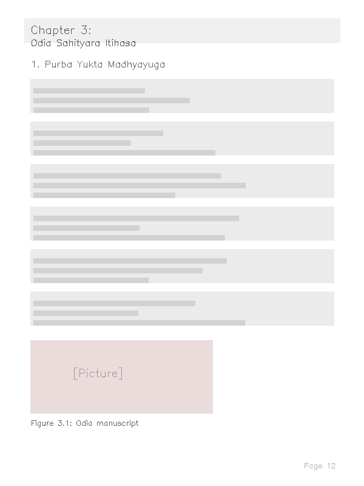
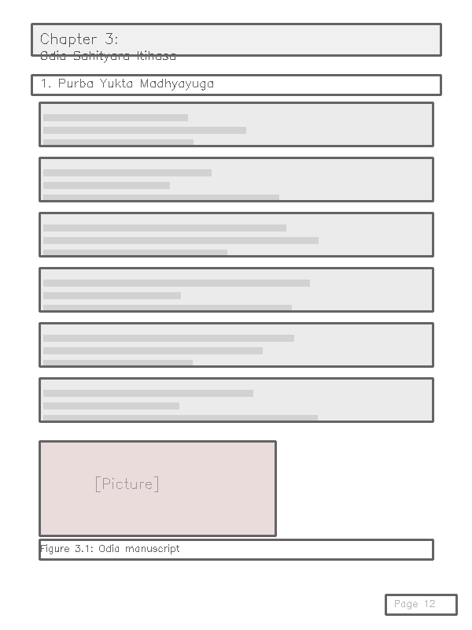
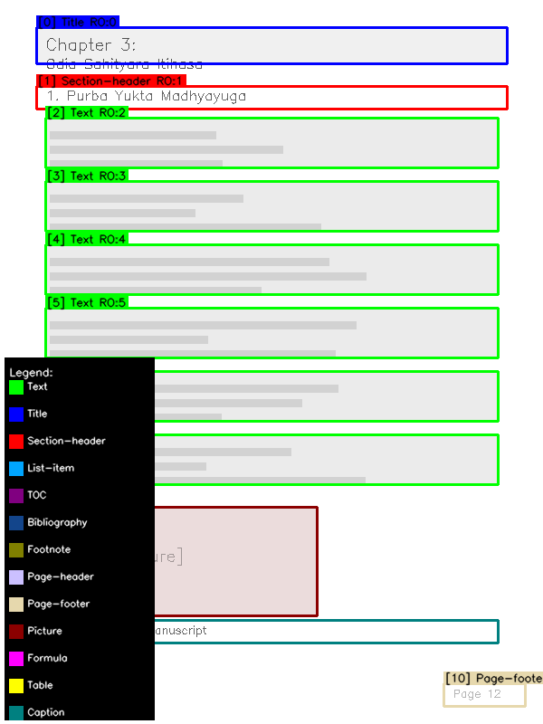
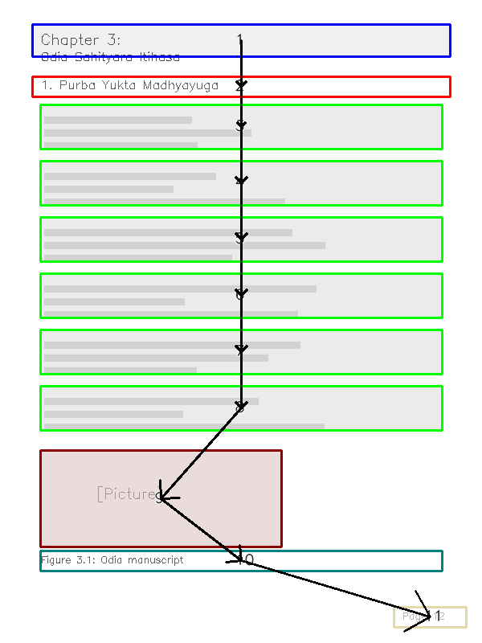
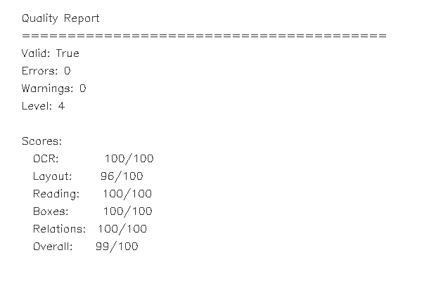
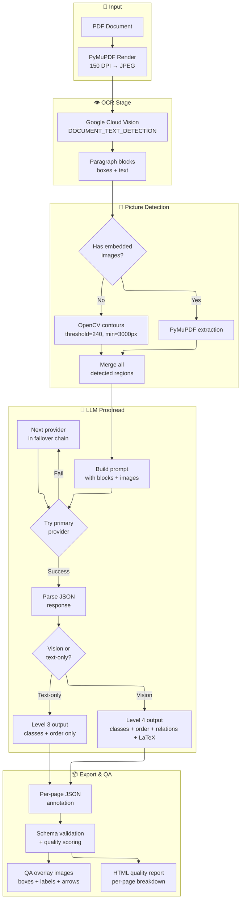
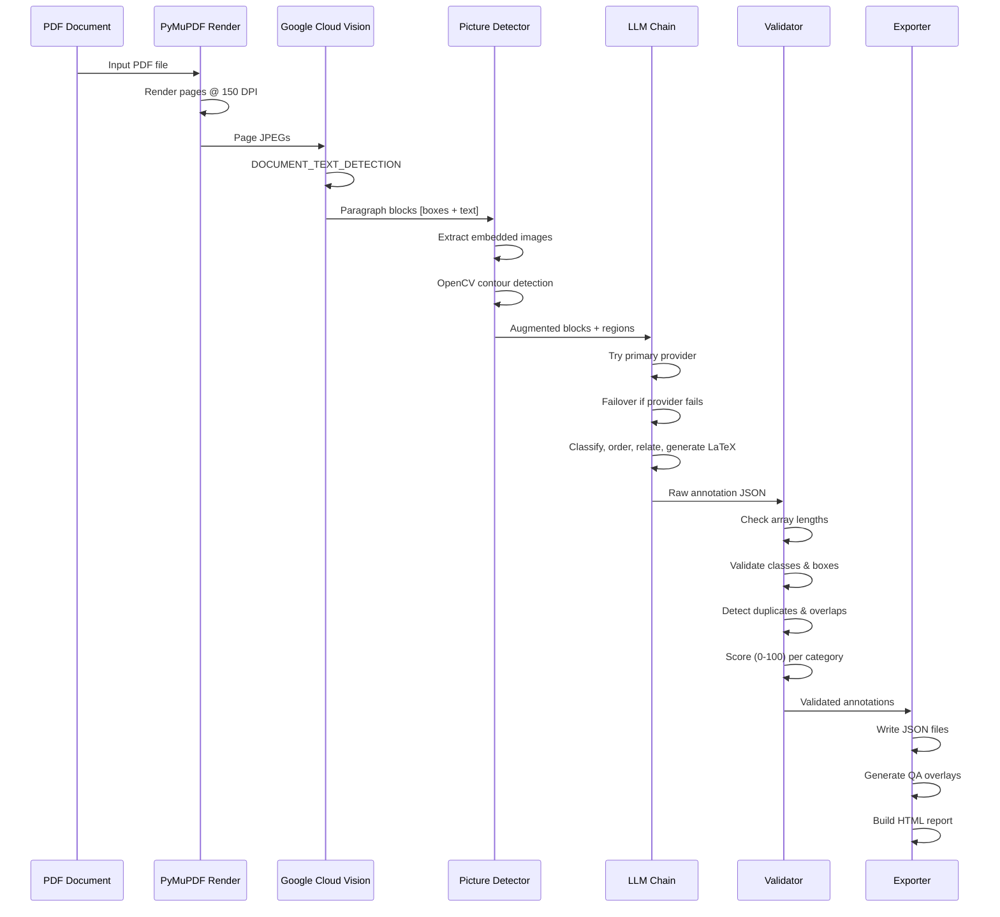
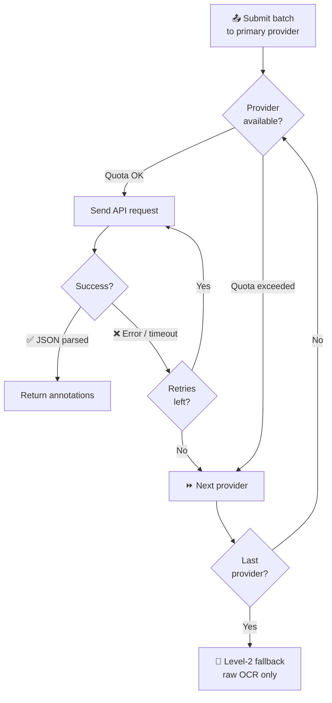

<div align="center">

# Indic OCR Pipeline

**RFQ Level 4 layout annotation for Indic-language scanned PDFs — free tier only.**

[](https://python.org)
[](LICENSE)
[](https://github.com/rai8053/indic-ocr-pipeline/actions)
[](https://github.com/psf/black)
[](https://github.com/astral-sh/ruff)
[](http://mypy-lang.org)
[](https://github.com/rai8053/indic-ocr-pipeline/actions)
[](CONTRIBUTING.md)
[](https://github.com/rai8053/indic-ocr-pipeline)

</div>

---

## Table of Contents

- [Overview](#overview)
  - [The Problem](#the-problem)
  - [Research Contribution](#research-contribution)
- [Pipeline Preview](#pipeline-preview)
- [Features](#features)
  - [Core](#core)
  - [Provider Failover](#provider-failover)
  - [Quality Assurance](#quality-assurance)
  - [Preprocessing & Export](#preprocessing--export)
  - [Supported Languages](#supported-languages)
  - [Use Cases](#use-cases)
- [Comparison with Alternatives](#comparison-with-alternatives)
- [Architecture](#architecture)
  - [Data Flow](#data-flow)
  - [Provider Failover](#provider-failover-1)
- [Example Transformation](#example-transformation)
- [Annotation Levels](#annotation-levels)
- [Installation](#installation)
- [Quick Start](#quick-start)
- [Configuration](#configuration)
- [Usage](#usage)
- [Providers](#providers)
- [Output Format](#output-format)
- [Project Structure](#project-structure)
- [Performance Benchmarks](#performance-benchmarks)
- [Limitations](#limitations)
- [Roadmap](#roadmap)
- [FAQ](#faq)
- [Troubleshooting](#troubleshooting)
- [Contributing](#contributing)
- [Citation](#citation)
- [License](#license)

---

## Overview

### The Problem

Existing OCR tools extract raw text but lose document structure. Given a scanned PDF page, they return paragraphs of text but cannot tell you which block is a **title**, a **footnote**, a **table caption**, or a **figure**. This makes the output unsuitable for training document-layout AI models.

### Why Indic OCR Is Difficult

| Challenge | Impact |
|---|---|
| Under-served scripts | Indic languages (Odia, Telugu, Tamil, Marathi, Bengali, etc.) have few commercial layout tools |
| English/Chinese bias | Most layout datasets and pre-trained models ignore Indic scripts |
| Complex scripts | Cursive glyphs, conjuncts, and non-Latin Unicode ranges challenge traditional OCR engines |

### What This Project Does

> **Indic OCR Pipeline** converts scanned Indic-language PDFs into **RFQ Level 4 annotations** — a structured dataset with class labels, reading order, caption relations, and LaTeX markup. It combines Google Cloud Vision OCR with a 5-provider LLM failover chain — all within free-tier API limits.

### Key Differentiators

| Capability | This Project | Typical OCR |
|---|---|---|
| Output type | Structured annotations (13 classes) | Raw text |
| Language focus | Indic-first (12 languages) | English/Chinese |
| Cost | **Free tier only** (quota-checked) | Paid API or local GPU |
| Provider resilience | 5-LLM failover chain | Single provider |
| Validation | Schema + scoring + QA overlays | None |
| Deployment | CLI + Docker + FastAPI | Usually one mode |

### Research Contribution

This project addresses the **document-layout annotation gap for low-resource Indic scripts** by combining:

1. **Free-tier cloud OCR** (Google Cloud Vision) for paragraph detection and transcription
2. **Multi-LLM failover** — a novel orchestration strategy that chains 5 providers with automatic degradation
3. **Schema-validated RFQ Level 4 output** — a complete document-layout training dataset format

The key insight is that **free-tier API limits can be managed through provider diversity**: when one hits quota, the next takes over, yielding higher overall throughput than any single provider alone.

---

## Pipeline Preview

<div align="center">
  <table>
    <tr>
      <td align="center"><strong>Input PDF</strong></td>
      <td align="center"><strong>OCR + Bounding Boxes</strong></td>
      <td align="center"><strong>RFQ Level‑4 Annotation</strong></td>
    </tr>
    <tr>
      <td></td>
      <td></td>
      <td></td>
    </tr>
    <tr>
      <td align="center"><em>Scanned Odia PDF page</em></td>
      <td align="center"><em>Google Vision paragraphs + boxes</em></td>
      <td align="center"><em>Classified blocks, reading order, relations</em></td>
    </tr>
  </table>
</div>

<div align="center">
  <table>
    <tr>
      <td align="center"><strong>QA Overlay</strong></td>
      <td align="center"><strong>Reading Order Arrows</strong></td>
      <td align="center"><strong>HTML Quality Report</strong></td>
    </tr>
    <tr>
      <td></td>
      <td></td>
      <td></td>
    </tr>
    <tr>
      <td align="center"><em>Colored boxes per class</em></td>
      <td align="center"><em>Arrow overlay for order</em></td>
      <td align="center"><em>Per-page score breakdown</em></td>
    </tr>
  </table>
</div>

---

## Features

### Core

| Feature | Description |
|---|---|
| **Google Cloud Vision OCR** | Paragraph-level bounding boxes with text transcription for all Indic scripts |
| **13-class RFQ classification** | Labels: Text, Title, Section-header, List-item, TOC, Bibliography, Footnote, Page-header, Page-footer, Picture, Formula, Table, Caption |
| **Reading order** | LLM-driven ordering with geometry-based fallback (`indic_ocr_pipeline/layout/reading_order.py`) |
| **Block relations** | Automatic caption↔figure, caption↔table, and footnote reference linking (`indic_ocr_pipeline/layout/relations.py`) |
| **LaTeX generation** | Tables and display formulas encoded as LaTeX at Level 4 |

### Provider Failover

| Feature | Description |
|---|---|
| **5-provider chain** | `gemini → glm → iamhc → openrouter → groq` (`indic_ocr_pipeline/providers/manager.py`) |
| **Vision + text-only** | Gemini/GLM/IAMHC are vision-capable; OpenRouter/Groq are text-only fallbacks |
| **Graceful degradation** | Degraded pages tagged `"degraded_text_only_fallback"` |
| **Quota pre-checks** | Per-provider limit checking before every API call |

### Quality Assurance

| Feature | Description |
|---|---|
| **Schema validation** | Array-length consistency, duplicate boxes, overlapping boxes, missing captions, relation integrity (`indic_ocr_pipeline/layout/validator.py`) |
| **Per-page scoring** | 0-100 scores for OCR quality, layout diversity, reading order, box validity, and relations |
| **QA overlay images** | Bounding boxes with class labels and reading-order arrows (`indic_ocr_pipeline/reporting/overlay.py`) |
| **HTML report** | Aggregate quality report with per-page breakdowns (`indic_ocr_pipeline/reporting/html.py`) |

### Preprocessing & Export

| Feature | Description |
|---|---|
| **OpenCV preprocessing** | Deskew, denoise, and contrast enhancement (`indic_ocr_pipeline/ocr/preprocessing.py`) |
| **Usage tracking** | Per-provider request/token logging with quota headroom dashboard (`indic_ocr_pipeline/utils/usage.py`) |
| **ZIP export** | Compress output to `{lang}_submission.zip` |
| **Docker** | Containerized CLI and API via Dockerfile + docker-compose |
| **FastAPI** | REST API with `/annotate`, `/batch`, `/health`, `/providers`, `/metrics` endpoints |

### Supported Languages

| Language | Code | Script | Language | Code | Script |
|---|---|---|---|---|---|
| Assamese | `assamese` | Bengali | Marathi | `marathi` | Devanagari |
| Bengali | `bengali` | Bengali | Odia | `odia` | Odia |
| Gujarati | `gujarati` | Gujarati | Punjabi | `punjabi` | Gurmukhi |
| Hindi | `hindi` | Devanagari | Tamil | `tamil` | Tamil |
| Kannada | `kannada` | Kannada | Telugu | `telugu` | Telugu |
| Malayalam | `malayalam` | Malayalam | Urdu | `urdu` | Perso-Arabic |

Languages are configured in `indic_ocr_pipeline/utils/config.py` (the `LANGUAGE_HINTS` dict). Adding a new language is a one-line change.

### Use Cases

| Domain | Application | How This Project Helps |
|---|---|---|
| **Digital libraries** | Preserve historical Indic texts | Converts scanned archives to structured, searchable annotations |
| **NLP research** | Train document-layout models | Produces RFQ Level-4 training data from raw PDFs |
| **Government archives** | Process gazettes and reports | Automates layout classification for large document collections |
| **Academic publishing** | Extract tables and formulas from papers | Generates LaTeX from scanned tables and display formulas |
| **OCR post-correction** | Fix transcription errors in Indic scripts | LLM proofreading improves text quality over raw OCR |
| **Dataset creation** | Build Indic document benchmarks | Schema-validated, scored, and ready for model training |

---

## Comparison with Alternatives

| Capability | **This Project** | Google Vision | PaddleOCR | EasyOCR | Tesseract |
|---|---|---|---|---|---|
| Indic script support | ✅ **12 languages** | ✅ 300+ langs | ⚠️ Limited | ⚠️ Limited | ⚠️ Requires lang pack |
| Layout classification | ✅ **13-class RFQ** | ❌ Text only | ❌ Text only | ❌ Text only | ❌ Text only |
| Reading order | ✅ **LLM + geometry** | ❌ | ❌ | ❌ | ❌ |
| Caption relations | ✅ **5 relation types** | ❌ | ❌ | ❌ | ❌ |
| Provider failover | ✅ **5-LLM chain** | ❌ Single API | ❌ | ❌ | ❌ |
| Dataset export | ✅ **RFQ Level-4 JSON** | ❌ Raw JSON | ❌ | ❌ | ❌ |
| Schema validation | ✅ **Array/class/relation checks** | ❌ | ❌ | ❌ | ❌ |
| Quality scoring | ✅ **Per-page 0-100** | ❌ | ❌ | ❌ | ❌ |
| QA overlays | ✅ **BBox + class + arrows** | ❌ | ❌ | ❌ | ❌ |
| Free-tier optimized | ✅ **Quota-checked** | ⚠️ 1k free/month | ✅ Free | ✅ Free | ✅ Free (local) |

> **Legend:** ✅ = supported · ⚠️ = partial · ❌ = not supported

---

## Architecture



### OCR Pipeline Flow



### Provider Failover Flow



### Validation Flow

```mermaid
graph TD
    A["Annotation JSON"] --> B["Required fields<br/>image, block_boxes,<br/>block_classes, block_text"]
    B --> C{"All present?"}
    C -->|No| ERR1["❌ Error: missing field"]
    C -->|Yes| D["Array lengths match<br/>boxes == classes == text"]
    D --> E{"Equal length?"}
    E -->|No| ERR2["❌ Error: length mismatch"]
    E -->|Yes| F["Box validation<br/>x2>x1, y2>y1, area≥500"]
    F --> G["Class validation<br/>all in VALID_CLASSES_SET"]
    G --> H["Duplicate detection<br/>boxes, text"]
    H --> I["Overlap detection<br/>>50% overlap → warning"]
    I --> J["Level 4 checks<br/>reading_order, relations"]
    J --> K["Quality scoring<br/>0-100 per category"]
    K --> L["✅ Validated + Scored"]

---

## Example Transformation

### From raw PDF to structured dataset

```
┌──────────────────┐
│   Input PDF      │  Scanned document (150 DPI)
│   (scanned)      │
└────────┬─────────┘
         ↓
┌──────────────────┐
│   Google Vision  │  Paragraph-level bounding boxes + text
│   OCR            │  ~0.07s per page
└────────┬─────────┘
         ↓
┌──────────────────┐
│   Picture Detect │  Embedded images + OpenCV contours
│   + Validate     │  Flag empty blocks, check schema
└────────┬─────────┘
         ↓
┌──────────────────┐
│   LLM Proofread  │  13-class classification, reading order,
│   (Level 4)      │  caption relations, LaTeX generation
└────────┬─────────┘
         ↓
┌──────────────────┐
│   Validate +     │  Array-length checks, duplicate/overlap
│   Score + QA     │  detection, per-page 0-100 scores
└────────┬─────────┘
         ↓
┌──────────────────┐
│   RFQ Level‑4    │  Structured JSON + QA overlays +
│   Dataset        │  HTML report
└──────────────────┘
```

### Before vs After

| Aspect | Raw OCR (Level 1) | Annotated (Level 4) |
|---|---|---|
| Block labels | None | `Title`, `Text`, `Table`, `Caption`, `Picture`, … |
| Reading order | Page order | Natural reading sequence |
| Relations | None | `caption_of_figure`, `table_has_caption`, … |
| Tables | Raw text | `\begin{tabular}...\end{tabular}` |
| Formulas | Raw text | `\frac{...}{...}` LaTeX |
| Validation | None | Schema checks + quality scores |
| Visualization | None | Color-coded overlays + arrows |

---

## Annotation Levels

| Level | Name | LLM Required | Content | Trigger |
|---|---|---|---|---|
| 1 | Raw OCR | No | `block_boxes`, `block_text` | Internal (always produced) |
| 2 | Fallback | No | Level 1 + all classes = `"Text"` | All providers failed |
| 3 | Classified | Yes | Level 2 + `block_classes`, `reading_order` | `--level 3` or degraded fallback |
| 4 | Full RFQ | Yes | Level 3 + `block_relations`, LaTeX in `block_text` | `--level 4` with vision provider |

CLI accepts `--level 3` or `--level 4` (default `4`). Levels 1–2 are internal fallback states.

Vision-capable providers (Gemini, GLM, IAMHC) produce full Level 4 output with `"annotation_quality": "full_level4"`. Text-only fallbacks (OpenRouter, Groq) produce Level 3 output tagged `"annotation_quality": "degraded_text_only_fallback"`.

---

## Installation

### Prerequisites

- **Python 3.10+**
- **API keys** — at least Google Cloud Vision + one LLM provider (see [Configuration](#configuration))

> 💡 **Tip:** You only need **2 keys** to get started: `GOOGLE_VISION_KEY` (free tier) and `GEMINI_API_KEY` (free tier). The other providers are optional fallbacks.

### From source

```bash
git clone https://github.com/rai8053/indic-ocr-pipeline.git
cd indic-ocr-pipeline

python -m venv .venv
source .venv/bin/activate       # Linux/macOS
# .venv\Scripts\activate        # Windows

pip install -r requirements.txt
```

### With uv (faster)

```bash
uv venv
source .venv/bin/activate
uv pip install -r requirements.txt
```

### Development install

```bash
pip install -r requirements-dev.txt
pip install -e .
pre-commit install
```

### Docker

```bash
docker compose build

# Run CLI
docker compose run --rm pipeline \
    --pdf /app/input/document.pdf \
    --lang odia \
    --out /app/output

# Run API
docker compose --profile api up -d
curl http://localhost:8000/health
```

---

## Quick Start

```bash
# 1. Configure your API keys
cp .env.example .env
# Edit .env with your keys

# 2. Process a PDF
python indic_ocr_pipeline3.py \
    --pdf path/to/document.pdf \
    --lang odia \
    --out ./output \
    --level 4

# 3. Use the interactive CLI
python run.py
```

---

## Configuration

### Environment variables (`.env`)

```bash
cp .env.example .env
```

| Variable | Required | Description |
|---|---|---|
| `GOOGLE_VISION_KEY` | **Yes** | Google Cloud Vision API key |
| `GEMINI_API_KEY` | Recommended | Gemini 2.5 Flash Lite |
| `GLM_API_KEY` | Optional | GLM-4V Flash |
| `IAMHC_API_KEY` | Optional | IAMHC relay |
| `OPENROUTER_API_KEY` | Optional | OpenRouter (free tier) |
| `GROQ_API_KEY` | Optional | Groq (free tier) |

> 📁 The `.env` file is auto-loaded from the project root (no manual `export` needed).  
> 🔄 Fallback variable names are accepted — e.g., `GOOGLE_VISION_API_KEY` also works for Vision.

### Configuration file

All tunable constants are in `indic_ocr_pipeline/utils/config.py`:

| Constant | Default | Description |
|---|---|---|
| `GEMINI_MODEL` | `gemini-2.5-flash-lite` | Gemini model name |
| `GLM_MODEL` | `glm-4v-flash` | GLM model name |
| `GROQ_MODEL` | `llama-3.3-70b-versatile` | Groq model name |
| `OPENROUTER_MODEL` | `meta-llama/llama-3.3-70b-instruct:free` | OpenRouter model |
| `IAMHC_MODEL` | `auto` | IAMHC relay model |
| `IAMHC_ENDPOINT` | `https://api.iamhc.cn/v1/chat/completions` | IAMHC endpoint |
| `RETRY_ATTEMPTS` | `3` | API retry count |
| `RETRY_BACKOFF_SECONDS` | `5` | Seconds between retries |
| `VISION_MONTHLY_LIMIT` | `1000` | Google Vision free tier monthly limit |
| `LLM_DAILY_LIMIT` | `1500` | Per-provider daily safety limit |
| `QUOTA_STATE_FILE` | `.pipeline_quota_state.json` | Quota persistence file |

---

## Usage

### CLI

```bash
# Process with default settings
python indic_ocr_pipeline3.py \
    --pdf document.pdf \
    --lang odia \
    --out ./output

# Specify provider and level
python indic_ocr_pipeline3.py \
    --pdf document.pdf \
    --lang tamil \
    --out ./output \
    --provider gemini \
    --level 4 \
    --batch-size 5

# Full featured run
python indic_ocr_pipeline3.py \
    --pdf document.pdf \
    --lang odia \
    --out ./output \
    --level 4 \
    --provider gemini \
    --batch-size 3 \
    --preprocess \
    --qa \
    --report \
    --validate \
    --zip \
    --max-pages 10
```

### Arguments

| Argument | Type | Default | Description |
|---|---|---|---|
| `--pdf` | `str` | **(required)** | Path to source PDF |
| `--lang` | `str` | `""` | Language code (`odia`, `tamil`, etc.) |
| `--out` | `str` | **(required)** | Output directory |
| `--dpi` | `int` | `150` | Page rendering DPI |
| `--jpeg-quality` | `int` | `60` | JPEG quality 1–100 |
| `--provider` | `str` | `"gemini"` | Primary provider: `gemini`, `glm`, `iamhc`, `openrouter`, `groq` |
| `--level` | `int` | `4` | Annotation level: `3` or `4` |
| `--batch-size` | `int` | `1` | Pages per LLM request |
| `--max-pages` | `int` | `0` | Process only first N pages (`0` = all) |
| `--samples` | `int` | `0` | Max samples in ZIP (`0` = all) |
| `--preprocess` | flag | — | Enable OpenCV deskew/denoise/contrast |
| `--qa` | flag | — | Generate QA overlay images |
| `--report` | flag | — | Generate HTML quality report |
| `--validate` | flag | — | Validate output JSON schemas |
| `--zip` | flag | — | Create submission ZIP archive |

> **Note on batch size:** Larger batches reduce total API calls but increase per-request tokens. If you see truncated JSON responses, reduce `--batch-size`.

### Common Workflows

```bash
# 📄 Quick annotation (single PDF, default settings)
python indic_ocr_pipeline3.py --pdf doc.pdf --lang odia --out ./output

# 🏭 Batch production run (with validation + report + ZIP)
python indic_ocr_pipeline3.py \
    --pdf doc.pdf --lang tamil --out ./output \
    --level 4 --batch-size 5 \
    --validate --report --zip

# 🔄 Retry with a different primary provider
python indic_ocr_pipeline3.py \
    --pdf doc.pdf --lang marathi --out ./output \
    --provider glm --level 4

# 🎯 Sample-based annotation (process every 5th page)
python indic_ocr_pipeline3.py \
    --pdf doc.pdf --lang odia --out ./output \
    --samples 5

# 📋 First N pages only (preview before full run)
python indic_ocr_pipeline3.py \
    --pdf doc.pdf --lang telugu --out ./output \
    --max-pages 3 --validate --report

# 🧹 With preprocessing for poor-quality scans
python indic_ocr_pipeline3.py \
    --pdf doc.pdf --lang odia --out ./output \
    --preprocess --qa

# 🐳 Docker (mount input/output volumes)
docker compose run --rm pipeline \
    --pdf /app/input/doc.pdf \
    --lang odia \
    --out /app/output \
    --level 4 --validate --report
```

### Interactive CLI

```bash
python run.py
```

Launches a Rich-powered interactive menu for step-by-step configuration.

### REST API (FastAPI)

```bash
pip install uvicorn
uvicorn api:app --host 0.0.0.0 --port 8000

# Health check
curl http://localhost:8000/health

# List providers
curl http://localhost:8000/providers

# Annotate a single PDF
curl -X POST http://localhost:8000/annotate \
    -F "file=@document.pdf" \
    -F "lang=odia" \
    -F "level=4"

# Batch annotate multiple PDFs
curl -X POST http://localhost:8000/batch \
    -F "files=@doc1.pdf" \
    -F "files=@doc2.pdf" \
    -F "lang=tamil"

# View usage metrics
curl http://localhost:8000/metrics
```

### Docker

```bash
# Process a PDF via Docker CLI
docker compose run --rm pipeline \
    --pdf /app/input/document.pdf \
    --lang odia \
    --out /app/output \
    --level 4 \
    --validate \
    --report

# Start the API
docker compose --profile api up -d
```

---

## Providers

### OCR

| Provider | Type | Endpoint | Free Tier |
|---|---|---|---|
| **Google Cloud Vision** | `DOCUMENT_TEXT_DETECTION` | `vision.googleapis.com` | 1,000 units/month |

The pipeline uses Google Cloud Vision for paragraph-level OCR. Each page returns bounding boxes and transcribed text. No other OCR backend is currently supported.

### LLM Proofreading

The pipeline chains five LLM providers. If the primary fails (quota exceeded, timeout, rate limit), the next is tried automatically.

| Provider | Vision? | Model | Free Tier Limits |
|---|---|---|---|
| **Gemini** | ✅ Yes | `gemini-2.5-flash-lite` | ~1,500 req/day |
| **GLM-4V** | ✅ Yes | `glm-4v-flash` | Rate-limited |
| **IAMHC** | ✅ Yes | `auto` (relay) | Varies |
| **OpenRouter** | ❌ No | `meta-llama/llama-3.3-70b-instruct:free` | Rate-limited |
| **Groq** | ❌ No | `llama-3.3-70b-versatile` | 30 RPM / 6k TPM / 1k RPD |

**Failover chains by primary provider:**

| Primary | Chain |
|---|---|
| `gemini` | `gemini → glm → iamhc → openrouter → groq` |
| `glm` | `glm → iamhc → openrouter → groq` |
| `iamhc` | `iamhc → openrouter → groq` |
| `openrouter` | `openrouter → groq` |
| `groq` | `groq` (no fallback) |

Pages processed by text-only providers (OpenRouter, Groq) are tagged `"annotation_quality": "degraded_text_only_fallback"` — they have class labels and reading order but no LaTeX or relations.

---

## Output Format

### Directory structure

```
output/
├── images/             # Page JPEG images
├── annotations/        # One JSON per page
│   ├── page_0001.json
│   ├── page_0002.json
│   └── ...
├── qa/                 # QA overlay images (--qa)
├── logs/               # Pipeline logs + metrics.jsonl
└── report/             # HTML quality report (--report)
```

### Annotation JSON schema

Each page produces one JSON file in `annotations/`. Arrays are **parallel** — index `i` in each array corresponds to the same block.

```json
{
  "image": "page_0001.jpg",
  "block_boxes": [
    [72, 98, 540, 142],
    [72, 155, 540, 482],
    [72, 495, 260, 540]
  ],
  "block_classes": [
    "Page-header",
    "Text",
    "Picture"
  ],
  "block_text": [
    "Chapter 3: ଓଡ଼ିଆ ସାହିତ୍ୟ",
    "ଓଡ଼ିଆ ସାହିତ୍ୟର ଇତିହାସ...",
    ""
  ],
  "reading_order": [0, 2, 1],
  "block_relations": [
    {"source": 0, "target": 1, "relation": "caption_of_figure"}
  ],
  "annotation_quality": "full_level4",
  "_ro_source": "llm"
}
```

> **Tip:** Fields marked `_` prefix are metadata. `reading_order` and `block_relations` appear only at Level 3+ and Level 4 respectively.

### Field reference

| Field | Level | Required | Type | Description |
|---|---|---|---|---|
| `image` | 1+ | ✅ | `string` | Page image filename (e.g., `page_0001.jpg`) |
| `block_boxes` | 1+ | ✅ | `[[x1,y1,x2,y2], …]` | Bounding boxes in pixel coordinates — one per block |
| `block_classes` | 3+ | ✅ | `[string, …]` | RFQ class label per block |
| `block_text` | 1+ | ✅ | `[string, …]` | Transcribed text; `""` for pictures; LaTeX for tables/formulas |
| `reading_order` | 3+ | ❌ | `[int, …]` | Permutation reordering arrays into reading sequence |
| `block_relations` | 4 | ❌ | `[{source, target, relation}]` | Directed relation edges between blocks |
| `annotation_quality` | 4 | ❌ | `string` | `"full_level4"` or `"degraded_text_only_fallback"` |
| `_ro_source` | 3 | ❌ | `string` | Reading order source: `"llm"`, `"geometry"`, or `"default"` |

> ⚠️ **All required arrays must have the same length.** This is enforced by `validate_page()` in `indic_ocr_pipeline/layout/validator.py`.

### Class taxonomy (13 classes)

```
Text, Title, Section-header, List-item, TOC, Bibliography,
Footnote, Page-header, Page-footer, Picture, Formula, Table, Caption
```

### Relation types

| Relation | Meaning |
|---|---|
| `caption_of_table` | Block A is the caption for a Table block |
| `table_has_caption` | Block A (Table) has a caption |
| `caption_of_figure` | Block A is the caption for a Picture block |
| `figure_has_caption` | Block A (Picture) has a caption |
| `footnote_refers_to` | Block A is a footnote referencing block B |

---

## Project Structure

```
indic-ocr-pipeline/
│
├── indic_ocr_pipeline3.py       # CLI entry point
├── run.py                        # Interactive CLI (Rich)
├── api.py                        # FastAPI REST wrapper
│
├── indic_ocr_pipeline/           # Main package
│   ├── pipeline/
│   │   ├── runner.py             # process_pdf() orchestrator
│   │   ├── orchestrator.py       # LLM prompt builders, JSON extraction
│   │   ├── exporter.py           # JSON & ZIP export
│   │   └── metrics.py            # Aggregate scoring
│   │
│   ├── providers/
│   │   ├── manager.py            # Failover chain, retry, IAMHC relay
│   │   ├── gemini.py             # Gemini 2.5 Flash Lite
│   │   ├── glm.py                # GLM-4V Flash
│   │   ├── groq.py               # Groq (Llama 3.3 70B)
│   │   └── openrouter.py         # OpenRouter (Llama 3.3 70B)
│   │
│   ├── layout/
│   │   ├── detector.py           # Picture region detection
│   │   ├── reading_order.py      # Geometry-based order fallback
│   │   ├── relations.py          # Auto relation detection
│   │   └── validator.py          # Schema validation + scoring
│   │
│   ├── ocr/
│   │   ├── google_vision.py      # Google Cloud Vision client
│   │   ├── preprocessing.py      # OpenCV deskew/denoise/contrast
│   │   └── rendering.py          # PyMuPDF page rendering
│   │
│   ├── reporting/
│   │   ├── html.py               # HTML quality report
│   │   ├── overlay.py            # QA overlay images
│   │   └── benchmark.py          # Timer utilities
│   │
│   ├── models/                   # Data classes
│   │   ├── annotation.py
│   │   ├── provider.py
│   │   ├── quality.py
│   │   └── relation.py
│   │
│   └── utils/
│       ├── config.py             # API keys, constants, limits
│       ├── usage.py              # Usage tracker + quota dashboard
│       ├── logging.py            # Pipeline logger
│       └── helpers.py            # Terminal I/O utilities
│
├── tests/                        # 21 tests (pytest)
│   ├── conftest.py
│   ├── test_config.py
│   ├── test_reading_order.py
│   ├── test_relations.py
│   ├── test_scoring.py
│   └── test_validation.py
│
├── docs/                         # Documentation (mkdocs)
├── samples/                      # Sample PDF generator
├── .github/workflows/ci.yml      # CI pipeline
│
├── Dockerfile
├── docker-compose.yml
├── .env.example
├── pyproject.toml
├── requirements.txt
├── requirements-dev.txt
├── CHANGELOG.md
├── CONTRIBUTING.md
├── CODE_OF_CONDUCT.md
├── SECURITY.md
├── LICENSE
└── CITATION.cff
```

---

## Performance Benchmarks

> 🚧 **Future Work — No pre-computed benchmarks yet.**  
> Performance data is collected per-run from live provider calls and logged to `metrics.jsonl`. Standardized benchmarks across all providers with reproducible test PDFs are planned.

### What gets measured

| Metric | Source | Description |
|---|---|---|
| **OCR latency** | Google Cloud Vision API | Time per page for paragraph detection |
| **LLM latency** | Per-provider API calls | Time per batch (including retries) |
| **Token counts** | Provider response headers | Input + output tokens per call |
| **Success rates** | Pipeline metrics | Pass/fail per provider per batch |
| **Stage timing** | `runner.py` timestamps | Render → OCR → Detect → Proofread → Export |

### How to view your results

```bash
# After a run, check the terminal summary
python indic_ocr_pipeline3.py --pdf doc.pdf --lang odia --out ./output

# Open the HTML report (requires --report flag)
open output/report/index.html

# Inspect raw per-request timing data
cat output/logs/metrics.jsonl

# Query through the API
curl http://localhost:8000/metrics
```

### Variables affecting performance

| Factor | Impact | Mitigation |
|---|---|---|
| **Vision vs text-only** | Vision providers 2–3× slower | Use Gemini (fastest vision) for primary |
| **Batch size** | Larger batches = less overhead | Balance: 3–5 pages typically optimal |
| **Document density** | More blocks = more tokens | Reduce `--batch-size` for dense pages |
| **Network latency** | Varies by provider region | Choose geo-closest provider endpoint |

> Standardized benchmarks using fixed test PDFs across all 5 providers is a planned feature. See [Roadmap](#roadmap).

---

## Limitations

- **Single OCR backend** — only Google Cloud Vision is supported; Tesseract, Azure OCR, and others are not integrated
- **Text-only fallback quality** — OpenRouter and Groq produce no LaTeX or relations (tagged as degraded)
- **Picture detection thresholds** — OpenCV defaults (`threshold=240`, `min_area=3000`) may need tuning for different scan qualities; adjust in `indic_ocr_pipeline/layout/detector.py`
- **Token limits** — pages with many blocks or complex layouts may produce truncated LLM responses; reduce `--batch-size`
- **Sequential processing** — pages are processed sequentially per batch; no parallelism
- **Windows Unicode** — terminal logging on cp437-encoded Windows terminals may crash with Indic text (handled via ASCII-safe fallback)
- **Mkdocs navigation** — the site config (`mkdocs.yml`) references 4 pages that do not yet exist in `docs/`: `providers.md`, `annotation-levels.md`, `validation.md`, `developer-guide.md`
- **No shell scripts** — no `.sh` or `.bat` launcher scripts provided

---

## Roadmap

### Completed

- [x] Multi-provider LLM failover chain (5 providers)
- [x] Picture region detection (embedded PDF images + OpenCV contours)
- [x] Schema validation and quality scoring
- [x] QA overlay images with bounding boxes, class labels, reading order arrows
- [x] HTML quality report with per-page breakdown
- [x] Module refactoring into `pipeline/`, `providers/`, `reporting/` structure
- [x] FastAPI REST wrapper (`/annotate`, `/batch`, `/health`, `/providers`, `/metrics`)
- [x] Docker support (Dockerfile + docker-compose with pipeline and api services)
- [x] 21 tests covering config, reading order, relations, scoring, validation

### Future

- [ ] Export to COCO / DocLayNet / HuggingFace Dataset formats
- [ ] Parallel page processing (multi-threaded or async)
- [ ] Web UI for upload, review, and annotation editing
- [ ] Documentation site (mkdocs) — complete missing pages
- [ ] Pre-computed benchmarks across all providers with standardized test PDFs
- [ ] Support for additional OCR backends (Tesseract, Azure AI Document Intelligence)
- [ ] Pre-built models for common Indic scripts
- [ ] Shell launcher scripts (`.sh` / `.bat`) for common workflows
- [ ] `uv`-based project configuration for faster installs

---

## FAQ

### How much does it cost to run?

**Nothing.** All providers have free tiers. The pipeline pre-checks quota before each call and stops gracefully when limits are reached.

### Which provider should I use?

Start with **Gemini** — it has the most generous free tier (~1,500 req/day) and reliable vision support. The pipeline auto-fallbacks if a provider is unavailable.

### Do I need all six API keys?

No. You need **Google Cloud Vision** (OCR) and at least **one LLM provider**. Gemini is recommended. The pipeline will skip providers with missing or empty keys.

### Can I run this on macOS/Linux?

Yes. The pipeline is pure Python with PyMuPDF for PDF rendering (no Poppler or Tesseract dependency). All system dependencies are Python packages.

### What happens if all providers fail?

The page is saved at **Level 2** (raw OCR output) with all classes set to `"Text"`. A warning is logged and the pipeline continues to the next page.

### How do I add a new language?

Add the language code to `LANGUAGE_HINTS` in `indic_ocr_pipeline/utils/config.py`. Google Cloud Vision supports all major Indic scripts.

### Can I use my own LLM API?

Yes. Any OpenAI-compatible endpoint can be added as a provider. Follow the pattern in `indic_ocr_pipeline/providers/` and register it in `manager.py`. See [CONTRIBUTING.md](CONTRIBUTING.md).

### How is this different from regular OCR?

Standard OCR returns raw text. This pipeline returns **structured annotations**: each text block has a class label (Title, Footnote, Table, etc.), a position in the reading order, relations to other blocks (caption-of, refers-to), and LaTeX for tables/formulas.

### What is RFQ Level 4?

A document-layout annotation standard that includes block-level class labels, natural reading order, caption relations, and LaTeX markup. This is the format used to train document-layout AI models.

### Why Google Cloud Vision specifically?

Google Cloud Vision offers the best **free-tier OCR quality for Indic scripts** (1,000 pages/month). It supports all 12 major Indic languages natively with paragraph-level bounding boxes, which few free alternatives match.

### Why multiple LLM providers instead of one?

Free-tier LLMs have **daily quotas and rate limits**. By chaining 5 providers (Gemini → GLM → IAMHC → OpenRouter → Groq), the pipeline achieves higher effective throughput than any single provider alone. When Gemini hits its 429 limit, GLM takes over, and so on.

### Can I use a local OCR engine like Tesseract?

Not currently. The pipeline only supports **Google Cloud Vision OCR**. Adding Tesseract or other backends is on the [Roadmap](#roadmap).

### Does this require a GPU?

**No.** All computation happens via cloud APIs (Google Cloud Vision + LLM providers). The local machine only runs PyMuPDF for PDF rendering and OpenCV for preprocessing/overlays — both CPU-only.

### What are the free-tier limits I should expect?

| Provider | Limit | Reset |
|---|---|---|
| Google Cloud Vision | 1,000 pages/month | Monthly billing cycle |
| Gemini 2.5 Flash Lite | ~1,500 requests/day | Midnight (America/Los_Angeles) |
| GLM-4V Flash | Rate-limited | Varies |
| OpenRouter (free) | Rate-limited | Varies |
| Groq | 30 RPM / 6k TPM / 1k RPD | Rolling window |

### What dataset formats can I export?

Currently **RFQ Level-4 JSON** (one file per page). Future formats include COCO, DocLayNet, and HuggingFace Dataset. See [Roadmap](#roadmap).

### How do I know my output is correct?

Every page goes through `validate_page()` which checks: array length consistency, class validity, box geometry, overlap percentages, duplicate detection, relation integrity, and missing captions. Results are surfaced in the HTML report and QA overlays.

### Can I process PDFs with mixed languages?

The `--lang` flag sets a single primary language. Mixed-language documents (e.g., Odia with English citations) are supported — Google Cloud Vision auto-detects additional scripts.

---

## Troubleshooting

| Symptom | Cause | Solution |
|---|---|---|
| **JSON parse errors / truncated responses** | LLM hit token limit | Reduce `--batch-size`; check `max_tokens` in `indic_ocr_pipeline/utils/config.py` |
| **`"annotation_quality": "degraded_text_only_fallback"`** | All vision providers failed; text-only fallback used | Wait for vision provider quota to reset, or set a different primary provider via `--provider` |
| **Low reading-order or relations scores** | Provider fallback or missing fields | Check `annotation_quality` first — degraded mode has no relations |
| **Gemini returns 429** | Daily quota exceeded | Reset is midnight America/Los_Angeles; use `--provider glm` or `--provider iamhc` in the meantime |
| **GLM times out** | Image payloads cause latency | Switch to `--provider gemini` or `--provider iamhc` |
| **OpenRouter 429** | Free model rate-limited | Wait or use a different provider |
| **Windows terminal shows garbage / crashes** | cp437 can't render Indic Unicode | Update to latest version (includes ASCII-safe logging fallback) |
| **`ModuleNotFoundError: No module named 'indic_ocr_pipeline'`** | Package not installed | Run `pip install -e .` from the project root |
| **`key GOOGLE_VISION_API_KEY` not found** | `.env` missing or incomplete | Copy `.env.example` to `.env` and fill in your keys |
| **OCR returns empty blocks** | Google Vision API key error or page is blank | Check your Vision API key and that the PDF renders correctly |

---

## Contributing

We welcome contributions. Please see [CONTRIBUTING.md](CONTRIBUTING.md) for the full guidelines.

### Quick start for developers

```bash
# Install dev dependencies
pip install -r requirements-dev.txt
pip install -e .
pre-commit install

# Run checks before submitting a PR
pytest                    # 21 tests
black .                   # Format code
ruff check .              # Lint
mypy .                    # Type check
```

### How to add a new provider

1. Create a provider module in `indic_ocr_pipeline/providers/` following the existing pattern
2. Add the API key constant in `indic_ocr_pipeline/utils/config.py`
3. Register the provider function in `indic_ocr_pipeline/providers/manager.py` (add to `_providers` dict and `run_proofread_batch` chain)
4. Add to `PROVIDER_INFO` in `indic_ocr_pipeline/utils/usage.py`
5. Add to CLI choices in `indic_ocr_pipeline/pipeline/runner.py`
6. Add to `.env.example`
7. Add to `/providers` endpoint in `api.py`
8. Test with a sample page

---

## Citation

```bibtex
@software{hazra_indic_ocr_2026,
  author = {Hazra, Raihan},
  title = {Indic OCR Dataset Pipeline},
  year = {2026},
  url = {https://github.com/rai8053/indic-ocr-pipeline}
}
```

---

## License

This project is licensed under the [MIT License](LICENSE).

---

<div align="center">
  <sub>Built with PyMuPDF, OpenCV, Google Cloud Vision, and free-tier LLM APIs.</sub>
  <br/>
  <sub>
    If you find this project useful,
    <a href="https://github.com/rai8053/indic-ocr-pipeline">⭐ star it on GitHub</a>
    and consider <a href="CONTRIBUTING.md">contributing</a>.
  </sub>
</div>
